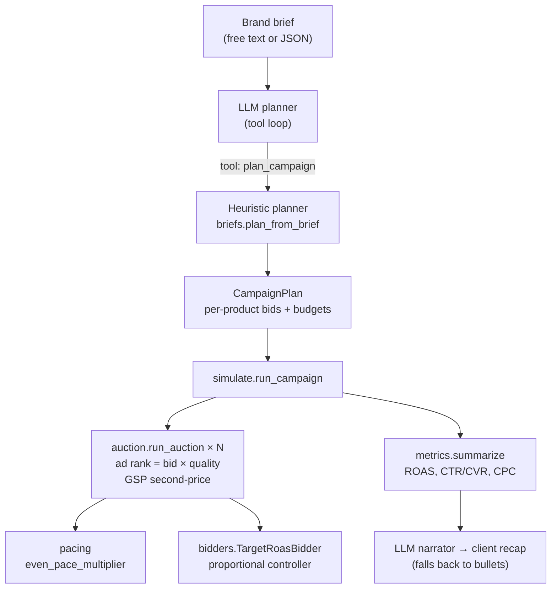

# Sponsored Search Auction Simulator


An open-source simulator for **sponsored product search auctions** — the engine
behind retail media networks. Hand it a brand brief and it plans a campaign,
runs thousands of synthetic auctions with budget pacing and ROAS-targeted
bidding, then writes a post-flight analysis.

> Independent demo project. All data is synthetic. Not affiliated with Walmart
> or any retailer.

## What it looks like

```bash
python scripts/run_simulation.py --n-auctions 20000 --budget 500 \
    --category "oat milk" --objective roas --target-roas 4.0
```

```
Category : oat milk  |  Objective: roas  |  Budget: $500.00
Spend    : $95.58
Revenue  : $688.74  (ROAS 7.21)
Funnel   : 4949 eligible auctions → 276 clicks (CTR 5.58%) → 67 conv (CVR 24.28%)
Avg CPC  : $0.35
Incremental revenue (est.): $516.56 (overlap 25%)

# Post-flight analysis
- Spend $95.58 → $688.74 attributed revenue (ROAS 7.21)
- 4949 impressions · CTR 5.58% · CVR 24.28% · avg CPC $0.35
## Top products by attributed revenue
- P0148: $52.76 spend → $384.06 revenue (ROAS 7.28)
- P0052: $34.67 spend → $282.80 revenue (ROAS 8.16)
- P0106: $6.84 spend → $21.88 revenue (ROAS 3.20)
```

## Architecture



## Quickstart

```bash
pip install -e ".[dev]"

# Full campaign from flags
python scripts/run_simulation.py --n-auctions 20000 --budget 500 \
    --category "oat milk" --objective roas --target-roas 4.0

# Structured brief (no API key needed)
python scripts/run_simulation.py \
    --brief-json '{"category":"pasta","budget":300,"objective":"roas"}'

# Free-text brief + LLM-written recap (needs ANTHROPIC_API_KEY or OPENAI_API_KEY)
python scripts/run_simulation.py \
    --brief-text "grow share in oat milk with $800, keep ROAS above 3" --narrate

# Interactive dashboard
streamlit run app/streamlit_app.py

# Unit tests + optimizer/planner evals (all offline)
pytest -q
```

## How it works

1. **Catalog** — synthetic products (price, margin, relevance, CTR/CVR) and a
   query plan with search volumes. (`catalog.py`)
2. **Plan** — a brief becomes per-product bids and budgets, anchored on
   expected profit per click. (`briefs.py`)
3. **Auctions** — per query, bidders rank by `bid × quality`; the winner pays
   second-price with a reserve. Clicks and conversions are sampled.
   (`auction.py`)
4. **Pacing + optimization** — bids scale for even delivery while a controller
   nudges each product's multiplier toward its ROAS target every 500 auctions.
   (`pacing.py`, `bidders.py`)
5. **Analysis** — ROAS, funnel metrics, a cannibalization proxy, and a
   post-flight recap. (`metrics.py`, `analysis.py`)

The math behind each step lives in [docs/methodology.md](docs/methodology.md).

## LLM layer

Provider-agnostic, zero new dependencies. The model never touches the numbers
directly: it plans by calling the deterministic `plan_campaign` tool and
narrates from the computed metrics, with automatic fallback when no API key is
set. Details, prompts, and the tool-loop protocol:
[docs/llm-agents.md](docs/llm-agents.md).

## Project structure

```
src/auction_sim/   library: catalog, auction, pacing, bidders, metrics,
                   briefs, analysis, simulate, llm/
scripts/           run_simulation.py (CLI), generate_data.py
app/               streamlit_app.py (dashboard)
evals/             behavior evals for the optimizer and planner
tests/             unit tests (scripted LLM client — runs offline)
docs/              methodology.md, llm-agents.md
```

## Roadmap

- Multi-slot auctions with position bias
- Headless harness comparing bidder strategies across seeds
- Dayparting and an offsite/display extension
- Trace viewer for the planner's tool loop

## Contributing

See [CONTRIBUTING.md](CONTRIBUTING.md). Ground rules: synthetic data only,
evals stay green, deterministic core with the LLM at the edges.

## License

MIT — see [LICENSE](LICENSE).
